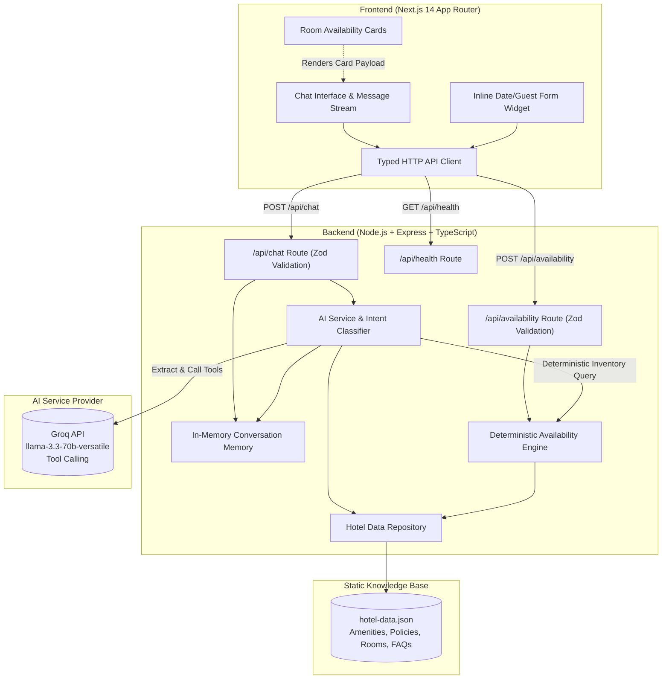
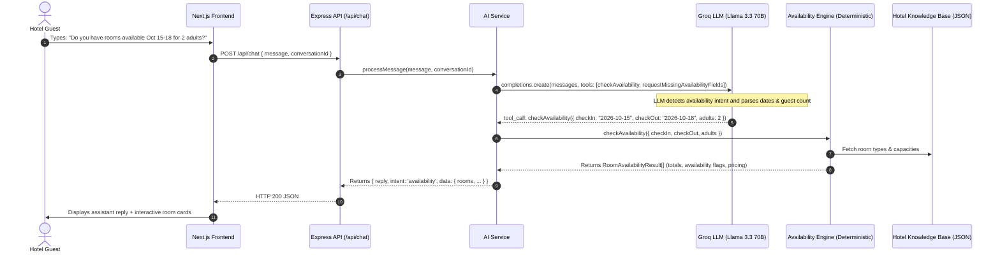
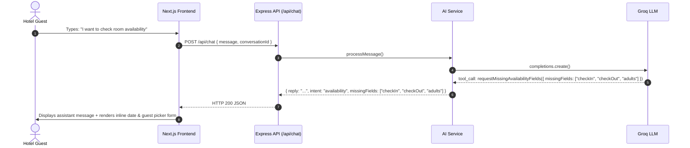

# System Architecture — Hotel Guest Assistant

This document outlines the end-to-end architecture, technical design, data flows, and AI integration mechanisms of the **Hotel Guest Assistant** full-stack web application.

---

## 1. High-Level Architecture Overview

The system consists of three distinct layers separated by clean network contracts:
1. **Frontend Layer (Next.js 14 / React / Tailwind CSS)**: Guest-facing responsive single-page chat experience running on port 3000.
2. **Backend API Layer (Node.js / Express / TypeScript)**: REST API service running on port 4000 handling validation, conversation memory, business logic, and tool routing.
3. **AI Reasoning & Tool-Execution Layer (Groq LLM + Deterministic Services)**: Natural language comprehension with Llama 3.3 70B, combined with a deterministic booking and inventory engine.



---

## 2. Intent Detection & Tool-Calling Pipeline

A critical architectural requirement is that **availability answers must NOT be guessed or hallucinated by the LLM**. Instead, the LLM acts as an extraction and conversational interface, while inventory logic remains 100% deterministic.

### Intent Classification Flow
When a message arrives at `POST /api/chat`, the system processes it through a strict pipeline:



### Missing Parameters Flow
If the guest indicates an interest in availability but omits critical fields (e.g., `"Do you have any rooms next Friday?"`):



---

## 3. Data Isolation & Hallucination Prevention (Retrieve-then-Generate RAG Pipeline)

To prevent unauthorized speculation, hallucinations, or prompt context bloat as the knowledge base grows:

```mermaid
sequenceDiagram
    autonumber
    actor Guest as Hotel Guest
    participant API as Express API (/api/chat)
    participant AI as AIService
    participant RAG as KnowledgeIndexService
    participant LLM as Groq LLM (Llama 3.3 70B)

    Guest->>API: POST /api/chat { message: "What time is check-in?" }
    API->>AI: processMessage(message, conversationId)
    AI->>RAG: getRelevantChunks(userMessage, topK=4)
    Note over RAG: Lexical + semantic cosine similarity search against precomputed chunk index
    RAG-->>AI: Returns Top-K chunks: [{ sourceRef: "hotel.check_in_time", text: "..." }]
    
    alt Chunks Found (Similarity >= 0.15 threshold)
        AI->>LLM: completions.create(systemPrompt: [Retrieved Chunks Only], userMessage)
        Note over LLM: Grounded strictly on retrieved chunks; refuses unsupported facts
        LLM-->>AI: Generated answer grounded in retrieved text
        AI-->>API: Returns { reply, intent: 'faq', sources: ['hotel.check_in_time'], conversationId }
    else Zero Chunks Above Threshold (< 0.15)
        Note over AI: Hard Groundedness Gate: Skips LLM to prevent hallucination
        AI-->>API: Returns { reply: "I do not have that information...", intent: 'fallback', sources: [] }
    end
    API-->>Guest: HTTP 200 JSON with answer and source references
```

### Key RAG Implementation Safeguards:
1. **Granular Chunking**: Rather than dumping the entire JSON document into the prompt, `KnowledgeIndexService` segments `hotel-data.json` into isolated logical units (individual FAQ items, individual room specifications, amenities, and policy declarations) with traceable `sourceRef` identifiers.
2. **Deterministic Top-K Retrieval**: Incoming guest queries are vectorized and matched against precomputed chunk embeddings using cosine similarity. Only the top-4 relevant chunks are passed to the prompt.
3. **Hard Groundedness Gate (Similarity Threshold)**: If no knowledge base chunks exceed a cosine similarity score of `0.15` (e.g., out-of-scope questions about external weather, third-party flights, or unrelated topics), the system skips the LLM call entirely and returns an immediate safe fallback message with `sources: []`.
4. **Source Attribution**: The API response includes a `sources` array listing the exact `sourceRef` entries (e.g. `hotel.check_in_time`, `amenities.pool`) used to answer the question, providing complete auditability.
5. **Deterministic Inventory Separation**: Room capacities and nightly totals remain strictly arithmetical and rule-based (`availabilityService`), completely isolated from LLM token speculation.

---

## 4. Conversation Memory Management

- **In-Memory Storage**: History is stored in a hash map keyed by `conversationId` (`UUIDv4`).
- **Sliding Window Context**: The backend maintains the last 10 conversation turns (20 messages max) per conversation ID. Older messages are truncated to prevent context bloat while preserving pronoun resolution (e.g., asking `"What time is check-in?"` followed by `"And what about breakfast?"`).
- **Client Synchronization**: The frontend passes its local message history as fallback context in the event of an ephemeral server restart, ensuring zero lost context for the guest.

---

## 5. Resilience & Fault Tolerance

| Failure Mode | Impact | Mitigation Strategy |
| :--- | :--- | :--- |
| **Groq API Rate Limit / Network Outage** | LLM cannot generate response | The backend catches the upstream exception, logs it with timestamp, and returns a structured fallback response (`intent: "fallback"`) directing the guest to the front desk. The server never crashes. |
| **Invalid Date Formats / Semantics** | Guest selects invalid checkout | The availability engine validates ISO format, check-out > check-in, and sensible guest counts, returning clear 400 validation messages. |
| **Frontend Network Disconnection** | Request times out (15s) | Next.js API client intercepts `AbortError`, presents an inline retry button and top notification banner allowing the guest to re-send with 1 click. |
| **Missing API Key in Development** | Developer boots without key | The backend automatically switches to a deterministic grounded mock mode, allowing full functionality, test passing, and UI preview without requiring credentials. |

---

## 6. Model Context Protocol (MCP) Interface

The repository includes a standalone Model Context Protocol (MCP) server (`backend/src/mcp/server.ts`) running over the official `@modelcontextprotocol/sdk` stdio transport.

> [!NOTE]
> The MCP server serves as a **parallel interface** over the existing core backend services, not a replacement. External AI agents (such as Claude Desktop, Cursor, or autonomous agent frameworks) invoke the exact same deterministic `availabilityService`, `knowledgeIndexService`, and `hotelDataRepository` that the Express HTTP routes use. This establishes a **single source of truth** across both web REST clients and external MCP agents, guaranteeing identical availability calculations, capacity constraints, pricing logic, and knowledge retrieval thresholds regardless of the calling channel.
