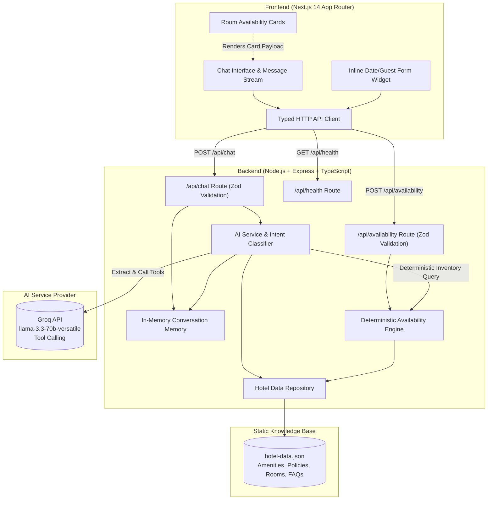
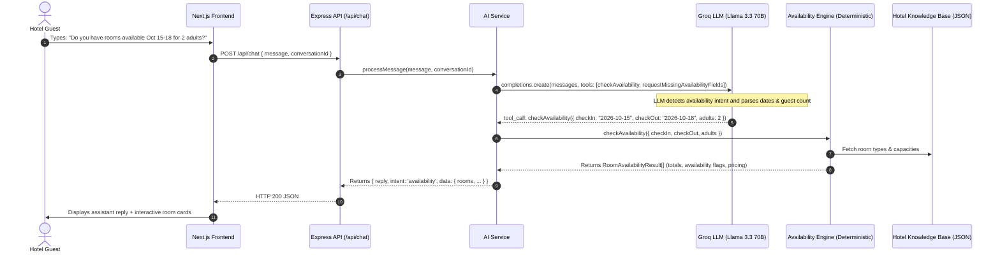
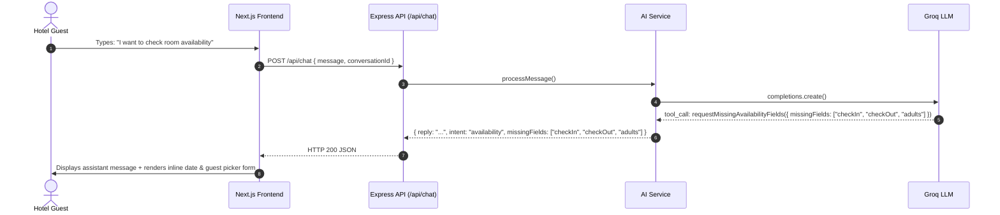

# System Architecture — Hotel Guest Assistant

This document outlines the end-to-end architecture, technical design, data flows, and AI integration mechanisms of the **Hotel Guest Assistant** full-stack web application.

---

## 1. High-Level Architecture Overview

The system consists of three distinct layers separated by clean network contracts:
1. **Frontend Layer (Next.js 14 / React / Tailwind CSS)**: Guest-facing responsive single-page chat experience running on port 3000.
2. **Backend API Layer (Node.js / Express / TypeScript)**: REST API service running on port 4000 handling validation, conversation memory, business logic, and tool routing.
3. **AI Reasoning & Tool-Execution Layer (Groq LLM + Deterministic Services)**: Natural language comprehension with Llama 3.3 70B, combined with a deterministic booking and inventory engine.

---

## 2. Intent Detection & Tool-Calling Pipeline

A critical architectural requirement is that **availability answers must NOT be guessed or hallucinated by the LLM**. Instead, the LLM acts as an extraction and conversational interface, while inventory logic remains 100% deterministic.

### Intent Classification Flow
When a message arrives at `POST /api/chat`, the system processes it through a strict pipeline:

### Missing Parameters Flow
If the guest indicates an interest in availability but omits critical fields (e.g., `"Do you have any rooms next Friday?"`):

---

## 3. Data Isolation & Hallucination Prevention

To prevent unauthorized speculation or incorrect answers:
1. **Strict System Prompt Injection**: The complete contents of `backend/data/hotel-data.json` are formatted and injected directly into the LLM system prompt.
2. **Explicit Grounding Guardrail**: The system prompt instructs the model:
   - Only answer using factual data present in the provided knowledge base.
   - For queries outside the knowledge base (e.g. weather, external booking, flights), refuse politely with the hotel front desk contact information.
   - Never speculate on room availability without invoking the `checkAvailability` tool.
3. **Deterministic Business Logic**:
   - Room capacities are strictly enforced (`maxOccupancy >= adults`).
   - Nightly totals are calculated arithmetically (`pricePerNight * nights`).
   - Availability is governed by rule-based inventory, never by language model token generation.

---

## 4. Conversation Memory Management

- **In-Memory Storage**: History is stored in a hash map keyed by `conversationId` (`UUIDv4`).
- **Sliding Window Context**: The backend maintains the last 10 conversation turns (20 messages max) per conversation ID. Older messages are truncated to prevent context bloat while preserving pronoun resolution (e.g., asking `"What time is check-in?"` followed by `"And what about breakfast?"`).
- **Client Synchronization**: The frontend passes its local message history as fallback context in the event of an ephemeral server restart, ensuring zero lost context for the guest.

---

## 5. Resilience & Fault Tolerance

| Failure Mode | Impact | Mitigation Strategy |
| :--- | :--- | :--- |
| **Groq API Rate Limit / Network Outage** | LLM cannot generate response | The backend catches the upstream exception, logs it with timestamp, and returns a structured fallback response (`intent: "fallback"`) directing the guest to the front desk. The server never crashes. |
| **Invalid Date Formats / Semantics** | Guest selects invalid checkout | The availability engine validates ISO format, check-out > check-in, and sensible guest counts, returning clear 400 validation messages. |
| **Frontend Network Disconnection** | Request times out (15s) | Next.js API client intercepts `AbortError`, presents an inline retry button and top notification banner allowing the guest to re-send with 1 click. |
| **Missing API Key in Development** | Developer boots without key | The backend automatically switches to a deterministic grounded mock mode, allowing full functionality, test passing, and UI preview without requiring credentials. |
